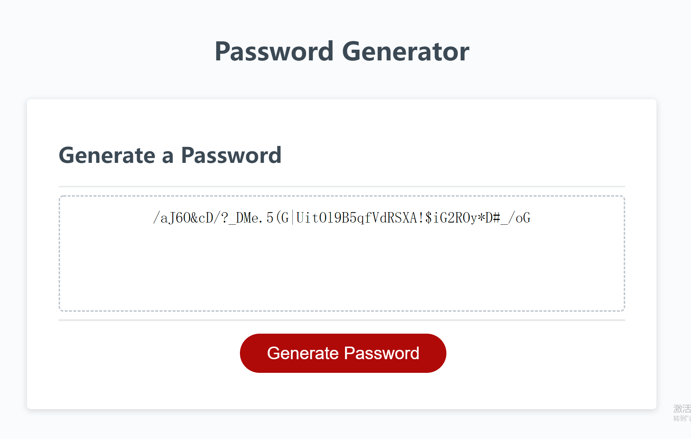

# Password-Generator

## Description

The project creates an web application that enables employees to generate random passwords based on criteria that they’ve selected. They can use whether or not to include lowercase, uppercase, numeric, and/or special characters. Also they need to specify the length of the password from 8 up to 128 characters. This app will run in the browser and will feature dynamically updated HTML and CSS powered by JavaScript code. It will have a clean and polished, responsive user interface that adapts to multiple screen sizes.

## Link

Click [here](https://jotaroc.github.io/Password-Generator/) to the deployed website

## Screenshot

The following image is the sceenshot of web application's appearance:

> **Note**: This layout is designed for desktop viewing, so you may notice that some of the elements don't look like the screenshot at a resolution smaller than 690px and 500px.
---
Author:Xingzhi Chang
